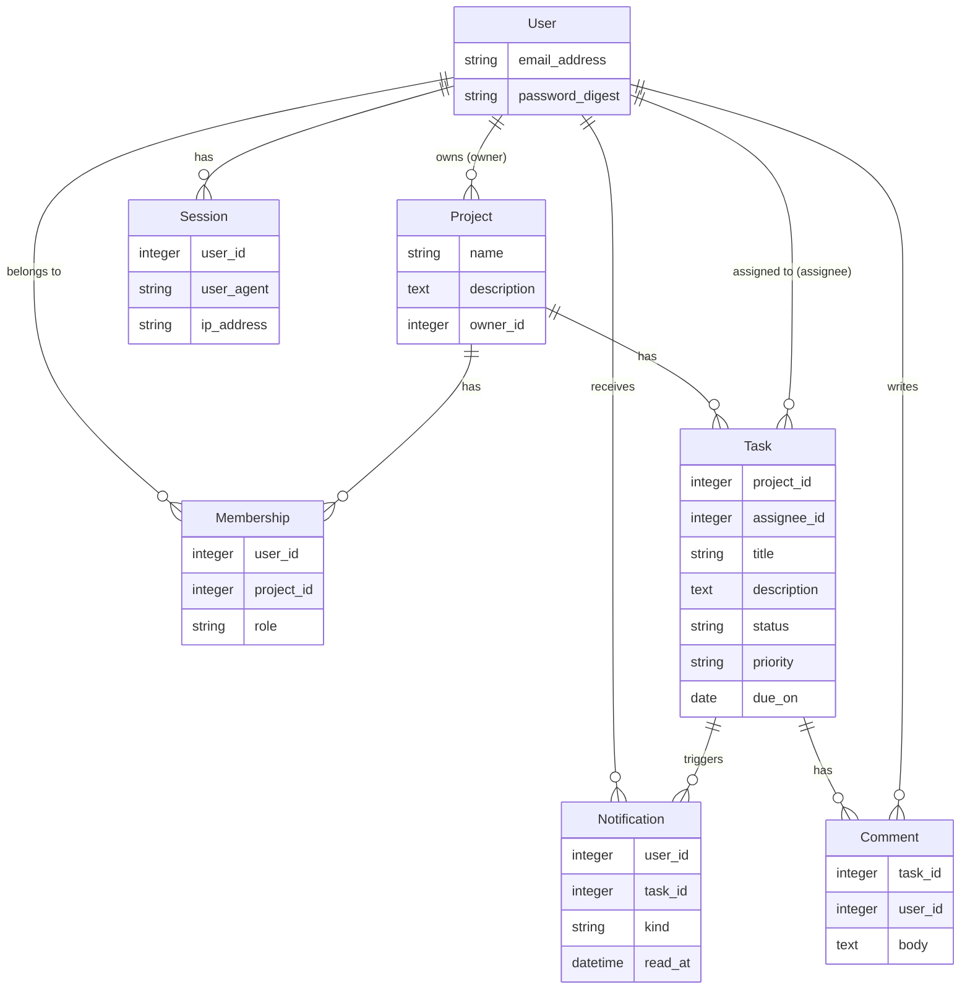
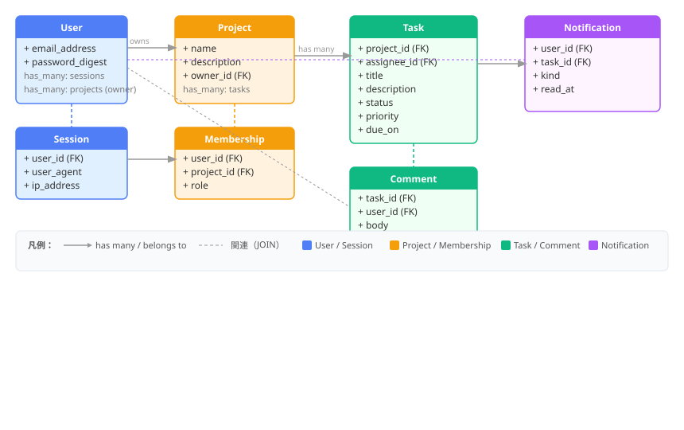

# サンプルアプリ案：Mini Team Board

チーム内で使う、軽量なタスク管理・通知アプリ

## 実装する機能

- ユーザー登録・ログイン
- プロジェクト作成
- タスク作成・担当者割り当て
- タスクのステータス変更
- コメント投稿
- タスク更新をリアルタイム反映
- 期限前リマインドをバックグラウンド実行
- ダッシュボードの集計をキャッシュ
- 本番デプロイはKamalで試す

## Rails8で試す機能と対応


| Rails 8要素                | このアプリでの使いどころ          |
| ------------------------ | --------------------- |
| Authentication generator | ログイン、セッション管理          |
| Solid Queue              | 期限リマインド、通知ジョブ         |
| Solid Cable              | コメント・ステータス変更のリアルタイム反映 |
| Solid Cache              | ダッシュボード集計のキャッシュ       |
| Propshaft                | CSS / JS / 画像アセット管理   |
| Hotwire / Turbo          | SPAにせず画面更新を軽く実装       |
| Kamal 2                  | VPSやクラウドVMへのデプロイ練習    |
| Thruster                 | 本番配信まわりの確認            |

## モデル設計

User
- email_address
- password_digest

Project
- name
- description
- owner_id

Membership
- user_id
- project_id
- role

Task
- project_id
- assignee_id
- title
- description
- status
- priority
- due_on

Comment
- task_id
- user_id
- body

Notification
- user_id
- task_id
- kind
- read_at

### ER図（Mermaid）



### データ構造図（SVG）



## 画面設計

```
/login
/projects
/projects/:id
/projects/:id/tasks/new
/tasks/:id
/dashboard
/notifications
```

## UI・画面遷移設計

### 全体の画面遷移

```
ログイン画面 (/session/new)
    ↓ ログイン成功
ダッシュボード (/) ←── 常にナビバーからアクセス可
    ↓
プロジェクト一覧 (/projects) ←── ナビバー
    ↓ 「プロジェクト作成」ボタン
    プロジェクト作成 (/projects/new)
        ※ owner は current_user を自動セット（入力不要）
    ↓ 作成完了 or 一覧から選択
    プロジェクト詳細 (/projects/:id)
        - プロジェクト情報
        - そのプロジェクトのタスク一覧
        - 「タスク追加」ボタン
            ↓
            タスク作成 (/projects/:id/tasks/new)
                ※ project_id は URL から自動セット
                ※ assignee はユーザー一覧のセレクトボックス
        ↓ タスクをクリック
        タスク詳細 (/tasks/:id)
            - タスク情報
            - ステータス変更ボタン（open → in_progress → done）
            - コメント一覧（Turbo Streamでリアルタイム）
            - コメント投稿フォーム
            - 「プロジェクトに戻る」リンク

通知一覧 (/notifications) ←── ナビバー（未読数バッジ付き）
    - 通知をクリック → タスク詳細へ
```

### ナビバー（全ページ共通）

```
[Mini Team Board]  プロジェクト  ダッシュボード  通知(n)  ログアウト
```

### 変更・改善ポイント

| 対象 | 変更内容 |
|---|---|
| `layouts/application.html.erb` | ナビバー追加 |
| `projects/_form.html.erb` | `owner_id` を hidden（current_user 自動セット） |
| `projects/show.html.erb` | タスク一覧 + 「タスク追加」ボタン追加 |
| `tasks/_form.html.erb` | `project_id` を hidden、`assignee_id` をセレクトボックスに変更、`status`・`priority` もセレクトボックス化 |
| `tasks/show.html.erb` | ステータス変更ボタン追加、「プロジェクトに戻る」リンク追加 |
| `routes.rb` | タスクをプロジェクト配下にネスト（`/projects/:id/tasks/new`）、通知ルート追加 |
| `ProjectsController` | `owner` を current_user で自動セット |
| 新規: `NotificationsController` | 通知一覧・既読処理 |

## Scaffold

```
bin/rails g scaffold Project name:string description:text owner:references
bin/rails g scaffold Task project:references assignee:references title:string description:text status:string priority:string due_on:date
bin/rails g scaffold Comment task:references user:references body:text
bin/rails g model Membership user:references project:references role:string
bin/rails g model Notification user:references task:references kind:string read_at:datetime
bin/rails db:migrate
```

## Solid Queueでジョブ

```
bin/rails g job TaskDueReminder
```

毎朝9時に今日機嫌のタスクを確認し、担当者にNotificationを作成。画面上に未読通知として表示する。

## Solid Cableでリアルタイム更新

タスク詳細画面を開いているときに、誰かがコメントを投稿したら自分の画面にも即時表示する

## Solid Cacheでダッシュボード高速化

キャッシュ対象は
- 自分の未完了タスク数
- 今日期限のタスク数
- プロジェクト別タスク数

```ruby
Rails.cache.fetch("dashboard:user:#{current_user.id}", expires_in: 10.minutes) do
  #集計処理
end
```

## MVP

1. ログインできる
2. プロジェクトを作れる
3. タスクを作れる
4. タスクにコメントできる
5. コメントがTurbo Streamで反映される
6. Solid Queueでタスクの期限通知を送信
7. ダッシュボードをキャッシュする

## 本番デプロイについて

```
Browser
  ↓
Azure Container Apps
  - Rails 8 app
  - Puma
  - Solid Queue worker
  - Solid Cable
  ↓ volume mount
Azure Files
  - production.sqlite3
  - cache.sqlite3
  - queue.sqlite3
  - cable.sqlite3
```

レプリカ数は1で固定、DBはSQLiteを使いAzure Filesへ

```yaml
# config/database.yml
production:
  primary:
    adapter: sqlite3
    database: /data/db/production.sqlite3

  cache:
    adapter: sqlite3
    database: /data/db/cache.sqlite3
    migrations_paths: db/cache_migrate

  queue:
    adapter: sqlite3
    database: /data/db/queue.sqlite3
    migrations_paths: db/queue_migrate

  cable:
    adapter: sqlite3
    database: /data/db/cable.sqlite3
    migrations_paths: db/cable_migrate
```

Container Apps側ではAzure Filesを /data にマウント

```
/data/db/production.sqlite3
/data/db/cache.sqlite3
/data/db/queue.sqlite3
/data/db/cable.sqlite3
```

Solid Queue workerはWebコンテナ内でPuma + Solid Queue supervisorを同居とする

Active Storageを使い、保存先はAzure Filesにする。
これはタスクに添付ファイルを付けられるようにするため。

```yaml
# config/storage.yml
local:
  service: Disk
  root: /data/storage
```

環境変数はシークレット参照とする

```
RAILS_ENV=production
RAILS_MASTER_KEY=...
RAILS_LOG_TO_STDOUT=true
RAILS_SERVE_STATIC_FILES=true
DATABASE_PATH=/data/db/production.sqlite3
CACHE_PATH=/data/db/cache.sqlite3
QUEUE_PATH=/data/db/queue.sqlite3
CABLE_PATH=/data/db/cable.sqlite3
STORAGE_PATH=/data/storage
```

## 実装の順番

1. ローカルSQLiteでRails 8アプリ作成
2. Authentication generatorを試す
3. Project / Task / Commentを作る
4. Turbo Streamでコメントをリアルタイム反映
5. Solid Queueで期限通知ジョブ
6. Solid Cacheでダッシュボード集計
7. Dockerfileでコンテナ化
8. Azure Container Registryへpush
9. Azure Container Apps作成
10. Azure Filesを/dataにマウント
11. min/max replicasを1に固定
12. 本番DBを/data/db/*.sqlite3に配置

## UI改善内容

### デザイン方針
- モダンでクリーンなデザイン（白/ライトグレー背景、アクセントカラー #4F7EF7）
- ナビバーは濃紺（#1e293b）でロゴ・ナビリンク・ユーザー情報を配置
- カード・テーブル・フォームに角丸・影・余白を統一
- system-uiフォント使用

### CSSクラス設計（app/assets/stylesheets/application.css）
- `.navbar` — 全ページ共通ナビバー
- `.container` — max-width: 960px、中央寄せ
- `.card` — 白背景・角丸・影・padding
- `.btn`, `.btn-primary`, `.btn-secondary`, `.btn-danger` — ボタンの色分け
- `.stat-grid` — ダッシュボード統計カード用3列固定グリッド
- `.status-open`, `.status-in_progress`, `.status-done` — ステータスバッジ
- `.priority-low`, `.priority-medium`, `.priority-high` — 優先度バッジ
- `.form-field`, `.form-card` — フォームレイアウト

### ApplicationHelper
- `task_status_label(status)` — DB値（open等）を日本語に変換
- `task_priority_label(priority)` — DB値（low等）を日本語に変換

### 主な改善箇所
- ナビバーに未読通知バッジ表示
- プロジェクト詳細にタスク一覧テーブルと「タスクを追加」ボタン
- タスク詳細にステータス変更ボタン（未着手→進行中→完了）
- ダッシュボードの統計3カードを等幅・等高で並列表示
- 全フォームのID入力をセレクトボックス・hiddenフィールドに変更

### 作業状況

- 開発部分については完了済み。bin/devを実行し動作確認をローカルで実施できる。
- Azureへのデプロイは未実施。Kamalを使ってみたいがSSHで環境へログインを行う仕組みのため、コンテナ環境で利用しようとする場合はあまり良さが活きない印象なので、まずはコンテナでのリリース作業をやってみる予定。
